# MCOC2020-P0

## Mi computador principal

Marca/modelo: MacBook Pro (13-inch, 2017, Two Thunderbolt 3 ports)

Tipo: Notebook

Año adquisición: 2018

Procesador:

	Modelo/marca: Intel Core i5-7360U 
	Velocidad Base: 2,30 GHz
	Velocidad Máxima: 3,60 GHz
	Número de nucleos: 2
	Número de Hilos: 4
	Arquitectura: Intel 64
	Set de instrucciones: Intel® SSE4.1, Intel® SSE4.2, Intel® AVX2

Tamaño de las cachés del procesador:

	L1i: 32 KB
	L1d: 32 KB
	L2: 256 KB
	L3: 4 MB

Memoria:

	Total: 8 Gb
	Tipo memoria: LPDDR3
	Velocidad: 2133 MHz
	Número de (SO)DIMM: 2

Tarjeta Gráfica:

	Marca/Modelo: Intel Iris Plus Graphics 640
	Memoria dedicada: 1536 MB
	Resolución: 2560 x 1600

Disco 1:

	Marca: APPLE
	Tipo: SSD
	Tamaño: 128 Gb
	Particiones: 1
	Sistema de archivos: APFS

Dirección MAC de la tarjeta wifi: 88:e9:fe:6a:6c:3b

Dirección IP (Interna, del router): 192.168.100.1

Dirección IP (Externa, del ISP): 192.168.100.113

Proveedor de internet: Entel fibra óptica

## DESEMPEÑO MATMUL:

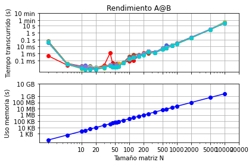

El gráfico difiere en los tiempos en que se realizá la mulplicación de cada tamaño de matriz. Esto puede deberse al procesador.

El gráfico es lineal debido a que la RAM va almacenando información de a poco, por lo que no depende de el tiempo como el otro gráfico, sino que depende de la cantidad de información entregada, lo que va variando según el tamaño de la matriz.

Python 3.8.1

Numpy 1.19.1

Se utiliza solo un procesador
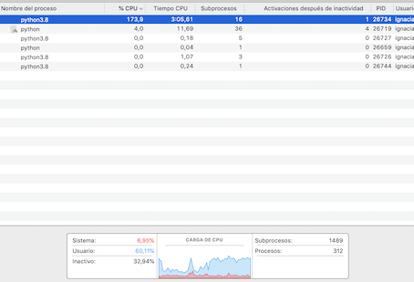

## MIMATMUL

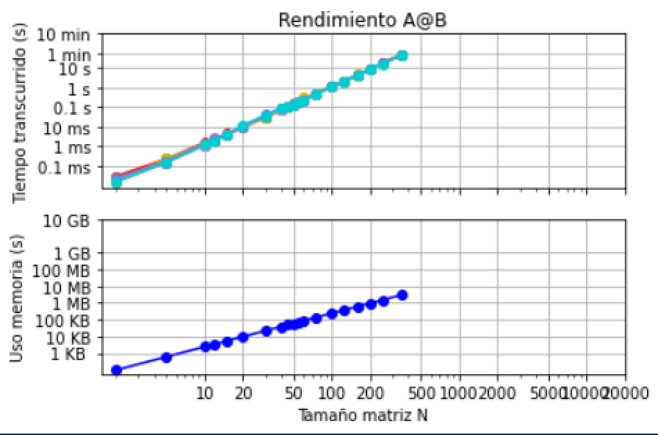

Los tiempos de multiplicación de matrices son mucho mayores al realizarlo en python puro. Al realizar el código de esta forma, no se optimiza de la mejor manera, se realiza de manera exponencial. Además, numpy esta escrito en un lenguaje de más bajo nivel que python (C, C++), lo que hace que el programa sea más rápido.

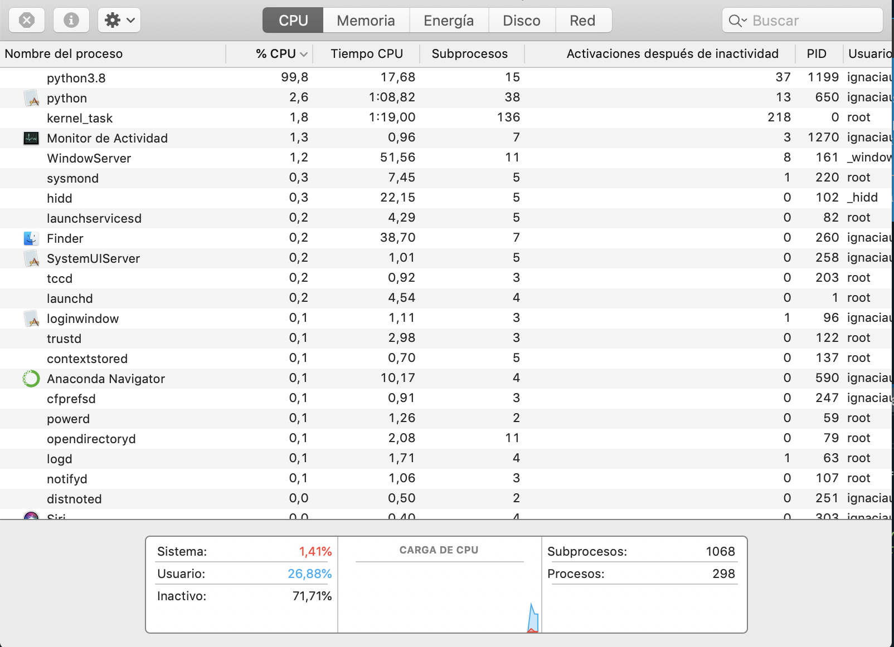

## DESEMPEÑO DE INV

### Caso 1
(Los gráficos half y longdouble no se incluyen debido a que np.linalg no soporta los tipos float16 y float128)
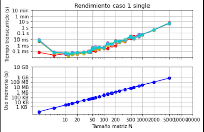 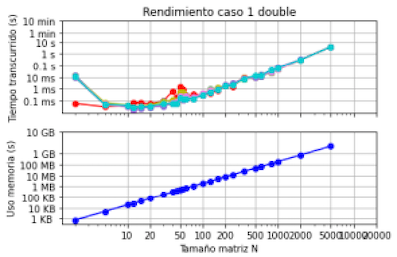 

### Caso 2

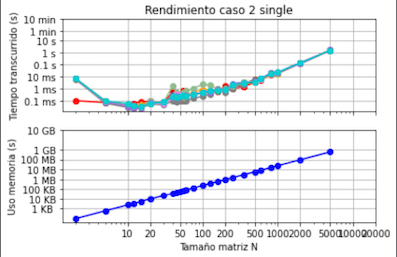 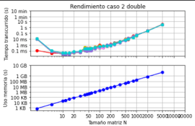 
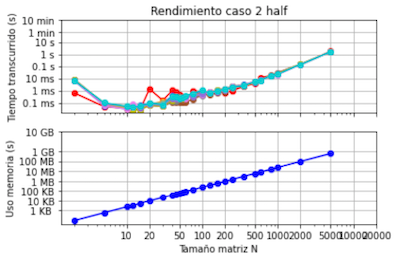 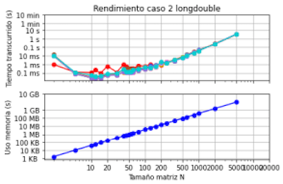 

### Caso 3

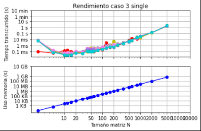 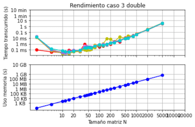 
 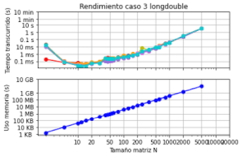 

En el caso de overwrite=True se puede apreciar que el tiempo transcurrido para para una matriz N es ligeramente menor. 
