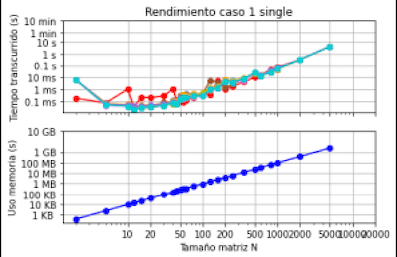
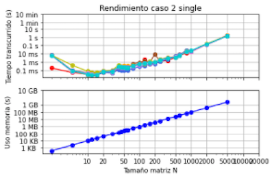
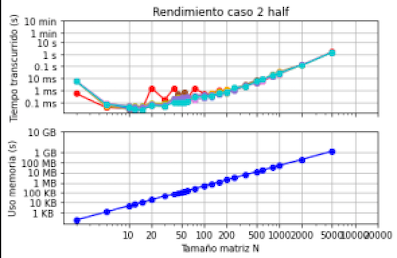
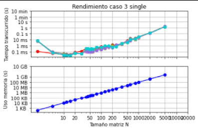
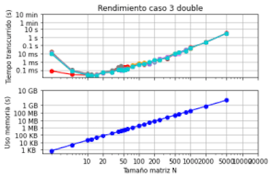
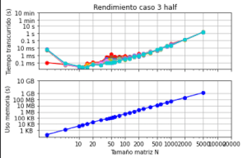
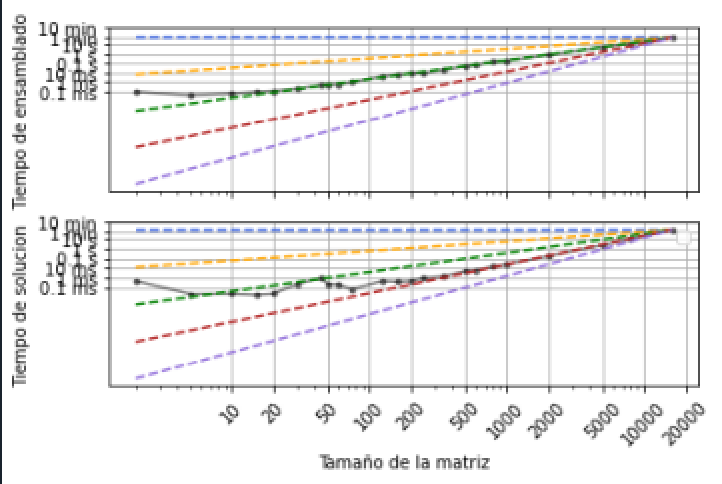

# MCOC2020-P0

## Mi computador principal

Marca/modelo: MacBook Pro (13-inch, 2017, Two Thunderbolt 3 ports)

Tipo: Notebook

Año adquisición: 2018

Procesador:

	Modelo/marca: Intel Core i5-7360U 
	Velocidad Base: 2,30 GHz
	Velocidad Máxima: 3,60 GHz
	Número de nucleos: 2
	Número de Hilos: 4
	Arquitectura: Intel 64
	Set de instrucciones: Intel® SSE4.1, Intel® SSE4.2, Intel® AVX2

Tamaño de las cachés del procesador:

	L1i: 32 KB
	L1d: 32 KB
	L2: 256 KB
	L3: 4 MB

Memoria:

	Total: 8 Gb
	Tipo memoria: LPDDR3
	Velocidad: 2133 MHz
	Número de (SO)DIMM: 2

Tarjeta Gráfica:

	Marca/Modelo: Intel Iris Plus Graphics 640
	Memoria dedicada: 1536 MB
	Resolución: 2560 x 1600

Disco 1:

	Marca: APPLE
	Tipo: SSD
	Tamaño: 128 Gb
	Particiones: 1
	Sistema de archivos: APFS

Dirección MAC de la tarjeta wifi: 88:e9:fe:6a:6c:3b

Dirección IP (Interna, del router): 192.168.100.1

Dirección IP (Externa, del ISP): 192.168.100.113

Proveedor de internet: Entel fibra óptica

## DESEMPEÑO MATMUL:

El gráfico difiere en los tiempos en que se realizá la mulplicación de cada tamaño de matriz. Esto puede deberse al procesador.

El gráfico es lineal debido a que la RAM va almacenando información de a poco, por lo que no depende de el tiempo como el otro gráfico, sino que depende de la cantidad de información entregada, lo que va variando según el tamaño de la matriz.

Python 3.8.1

Numpy 1.19.1

Se utiliza solo un procesador

## MIMATMUL

Los tiempos de multiplicación de matrices son mucho mayores al realizarlo en python puro. Al realizar el código de esta forma, no se optimiza de la mejor manera, se realiza de manera exponencial. Además, numpy esta escrito en un lenguaje de más bajo nivel que python (C, C++), lo que hace que el programa sea más rápido.

## DESEMPEÑO DE INV

### Caso 1
(Los gráficos half y longdouble no se incluyen debido a que np.linalg no soporta los tipos float16 y float128)
  

### Caso 2

  
  

### Caso 3

  
  

- En el caso de overwrite=True se puede apreciar que el tiempo transcurrido para para una matriz N es ligeramente menor. Además, se puede apreciar que el uso de memoria aumenta a medida que aumentan los bits (half<single<double<longdouble).

- ¿Qué algoritmo de inversión cree que utiliza cada método?
Para obtener la inversa de A numpy, al igual que scipy, utiliza la matriz identidad y realiza una factorización LU.

- ¿Como incide el paralelismo y la estructura de caché de su procesador en el desempeño en cada caso? 

## DESEMPEÑO Ax=b

- Se puede observar en el gráfico que para matrices más pequeñas el mejor desempeño lo tiene el solver de numpy. Sin embargo, para matrices más grandes spSolve_pos con o sin overwrite tuvieron un mejor desempeño.
- Para el caso spSolve_pos con overwrite, el sobreescribir los datos de A y b no generó una diferencia realmente significativa para matrices de gran tamaño, pero en matrices pequeñas, este proceso fue más eficiente que sin el overwrite.
- Como era de esperarse, el solver con peor desempeño fue el que requeria invertir la matriz y luego multiplicarla por b. Sin embargo, se puede notar que para matrices pequeñas no es el con el peor desempeño.
- Si bien en matrices pequeñas el desempeño de los distintos solvers varía bastante en matrices pequeñas, a medida que estas aumentan de tamaño, los solvers comienzan a tener un desempeño bastante similar entre sí.
- Además, se puede observar que para el caso del solver spSolve symmetric no hubo una diferencia extremadamente notoria en el rendimiento.

## Matrices dispersas y complejidad computacional

### Código matrices 

import numpy as np

from scipy.sparse import lil_matrix, csc_matrix

def matriz_laplaciana_llena(N, dtype = np.double):

    A = np.identity(N, dtype) * 2
    
    for i in range(N):
    
        for j in range(N):
	
            if i + 1 == j or i == j + 1:
	    
                A[i, j] = - 1

    return A      

def matriz_laplaciana_dispersa(N, dtype = np.double):

    A = lil_matrix((N,N))
    
    for i in range(N):
    
        for j in range(N):
	
            if i == j:
	    
                A[i, j] = 2
		
            if (i + 1) == j or (i - 1) == j: 
	    
                A[i, j] = - 1     
		
    return csc_matrix(A)

*  Matmul matriz llena

* Matmul matriz dispersa

* Solve matriz llena

* Solve matriz dispersa

* INV matriz llena

* INV matriz dispersa

